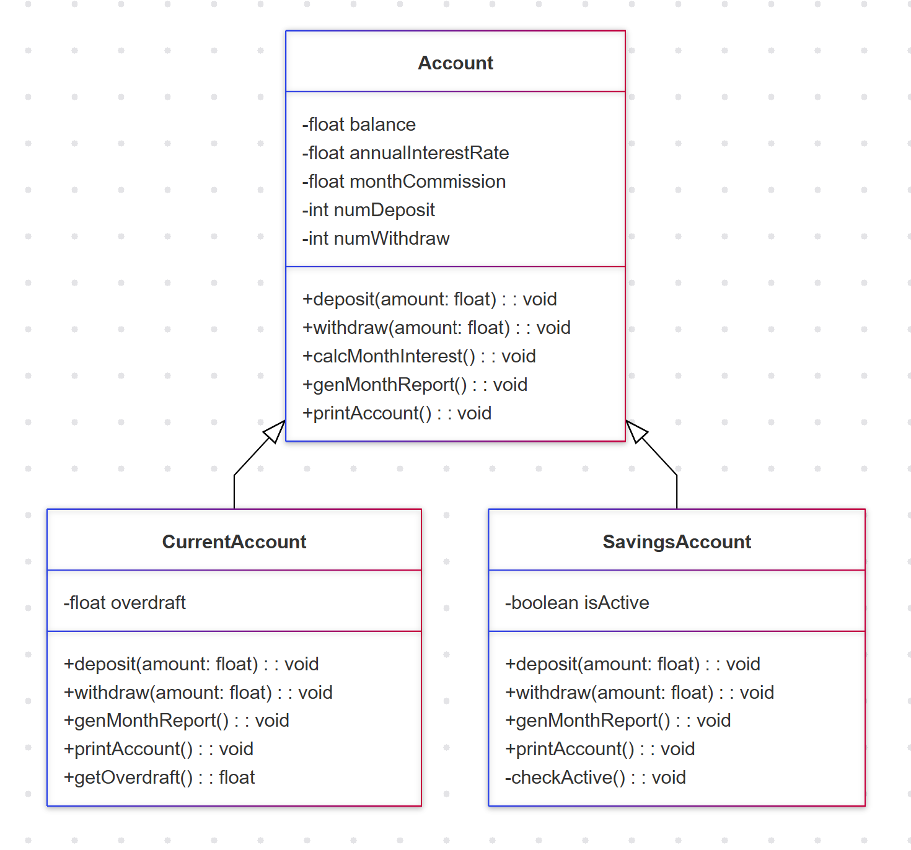
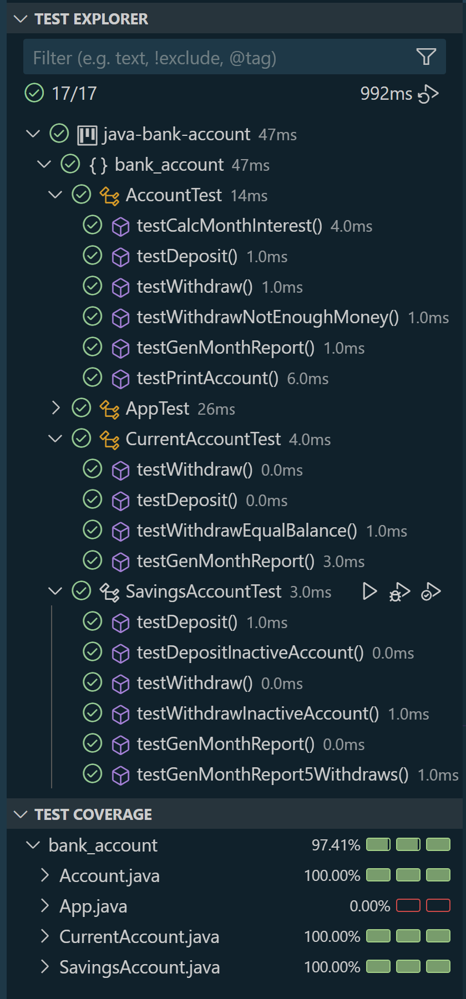

# Bank Account

## Description
This project models a bank account in Java. The `Account` class has attributes for balance, number of deposits, number of withdrawals, annual interest rate, and monthly commission. The class includes methods to deposit and withdraw money, calculate monthly interest, generate a monthly statement, and print the values of the attributes.

The `Account` class has two subclasses:
- **SavingsAccount**: Contains an attribute to determine if the account is active (type boolean). If the balance is below $10,000, the account is inactive. Otherwise, it is considered active. The following methods are overridden:
    - Deposit: Can only deposit money if the account is active.
    - Withdraw: Can only withdraw money if the account is active.
    - Monthly statement: If the number of withdrawals exceeds 4, a commission of $1,000 is charged for each additional withdrawal. The statement also checks if the account is active based on the balance.
    - A new print method returns the balance, monthly commission, and the number of transactions (sum of deposits and withdrawals).
  
- **CurrentAccount**: Contains an overdraft attribute, initialized to zero. The following methods are overridden:
    - Withdraw: Allows withdrawing money beyond the balance. The amount owed becomes the overdraft.
    - Deposit: Reduces the overdraft if there is one before updating the balance.
    - Monthly statement: Invokes the base method for processing.
    - A new print method returns the balance, monthly commission, the number of transactions, and the overdraft amount.

## Requirements
- Class UML diagram
- Unit tests (minimum coverage 70%)


## Instructions

### UML Diagram
The UML diagram for the classes `Account`, `SavingsAccount`, and `CurrentAccount` can be viewed [here](/screenshots/diagram.png).



### Testing
Unit tests have been implemented to ensure the correct functionality of the bank account logic, including deposits, withdrawals, monthly statements, and handling of overdrafts and active/inactive statuses.

The test covering for the classes `Account`, `SavingsAccount`, and `CurrentAccount` can be viewed [here](/screenshots/test_cover.png).




### How to Run
1. Clone the repository: 
    ```
    git clone https://github.com/yourusername/bank-account.git
    ```
2. Navigate to the project folder:
    ```
    cd bank-account
    ```
3. Run the tests using your preferred method in VSCode or using Maven/Gradle (depending on your project setup).

4. Ensure that the code coverage is at least 70%.

## Contact me with:
**Nelli Yanchuk** [GitHub](https://github.com/NelliYanchuk) / [LinkedIn](https://www.linkedin.com/in/nelli-yanchuk-a24b81138/)
